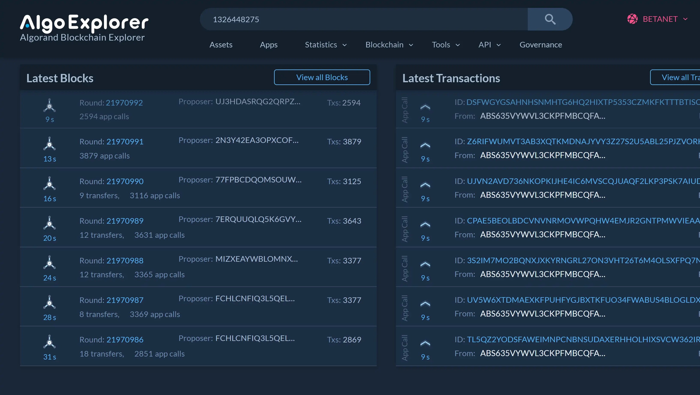

## Stress test for Algorand boxes

In this test 750,000 boxes, worth 38Mb of data will be created, written to, read and replaced.  
Betanet appID: 1326448275

This contract has two main methods, `createBigBoxes` and `createManyBoxes`

### createBigBoxes

This method will run in a loop for the number of times set in app args 1.
Optimally, it will do 10 iteration preceded by 24 empty calls to augment the opCode budget.

In that optimal scenario calling `callAppBigBoxes(10,24)` will form a group of 10 transaction, used to pass the 10 separate box reference for the loop. The 240 empty app calls will be made as inner tx.

Each iteration of the loop will create a box of 32Kb, iterate over that box and fill it with the box name. Box length is asserted to be nominal. The box is then read by chunks of 64 bytes and we log any event where the read value did not match the expected value. Finally the box is deleted to free up the mbr and another iteration of the loop occurs, starting the process all over with a different box.

One of this group transaction will thus, create, write and read 320kb worth of data in 10 separate boxes.

### createManyBoxes

This method will create many small boxes of 8 bytes each.
Due to box references limitations, we send a group of 16 transactions that can contain references for 127 boxes.
This method will iterate over these 127 boxes n times, create them, write max uint64 to them, read them, log any error and move over to the next iteration.

In an optimal scenario calling `callAppManyBoxes(7500,240)` will form a group of 16 transaction, used to pass the 127 separate box reference for the loop. The 240 empty app calls will be made as inner tx to maximize our opcode budget and we are able to run 7500 iterations total.

---

### Stress testing boxes

First make sure your account whose mnemo you input in the .env file is funded with >60 betanet Algo. Roughly 50k app calls will be made in total.

By running `npm run start` an array of 200 group transactions will be made and sent to the broadcast queue.
To broadcast the calls and avoid getting rate limited we use all the providers available, algonode, algoexplorer and purestake. Make sure to input your purestake key in the .env file.

The queue will then broadcast the 200 txs in a matter of a few seconds. I suspect the endpoints are behind some sort of load balancer because the transactions are broadcast in about 6 seconds, they should fill 2 blocks with 25k app calls each but these tx are rather spread over several blocks containing 3K app calls each. A solution to this would be to set up my own node, which I haven't done for this test.

